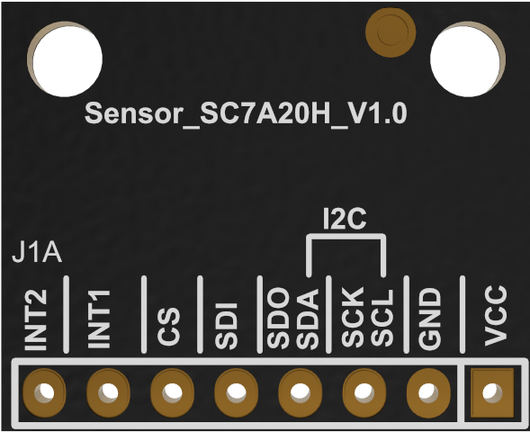

[中文](https://github.com/WeCanSTU/SC7A20H-Accelerometer/blob/main/README_CN.md) / [English](https://github.com/WeCanSTU/SC7A20H-Accelerometer/blob/main/README.md)

### **Overview**

The SC7A20H module is a high-performance, low-power 3-axis digital accelerometer sensor based on the SC7A20H chip. It supports **I2C** and **SPI** communication interfaces, offering flexible acceleration range settings, wide operating temperature capability (-40°C to +85°C), and low power consumption. Designed for consumer electronics, industrial control, sports health, and other fields, its compact design and pin layout allow developers to quickly integrate it into challenging environments and a variety of application scenarios, enabling seamless product innovation.

  
  
<em>Figure 1: SC7A20H Sensor Module Overview</em>

### **Key Features**

The SC7A20H module combines a variety of technical advantages, providing developers with diversified options and flexibility:

- **High-Precision Sensing Capability**
    - Supports four acceleration ranges: ±2g, ±4g, ±8g, and ±16g, suitable for scenarios ranging from fine movements to strong vibrations.
    - Output Data Rate (ODR): Supports 1Hz to 400Hz, adjustable based on application scenarios.
    - Built-in 32-level FIFO buffer: Reduces the frequency of data reads by the master device, optimizing system power consumption and operational efficiency.
- **Wide Temperature Operating Range**
    - Operating temperature range: **40°C to +85°C**, capable of adapting to extreme environments from freezing cold to high heat, meeting the requirements of industrial, outdoor, and other special applications.
    - **Storage temperature range: -55°C to +150°C**, ensuring stable performance even under extreme storage conditions.
- **Wide Voltage Compatibility**
    - Operating voltage range: **1.71V to 3.6V**, compatible with a variety of hardware platforms.
    - Supports **1.8V digital IO compatibility**, making it easier to communicate directly with mainstream low-power chips.
- **Flexible Communication and Interrupt Mechanism**
    - Supports **I2C** (up to 400kHz) and **SPI** (up to 10MHz) dual communication protocols, compatible with mainstream microcontrollers and embedded platforms.
    - Provides rich interrupt functions, including free-fall detection, activity monitoring, and orientation recognition, conveniently implemented through **INT1** and **INT2** pins.
- **Low-Power Design**
    - In low-power mode, the operating current is only **2µA**, effectively extending the battery life of power-constrained devices.

### **Module Design**

The SC7A20H module features the following design highlights:

1. **Clear Pin Layout**
   
    The module adopts a standardized pin design, including VCC, GND, SCL, SDA, etc., allowing developers to quickly understand and connect, reducing development time.
    
    

        
        
<em>Figure 2: SC7A20H Sensor Module Front View</em>

    

    
2. **Compact Size**
   
    The module measures only **21 mm × 17 mm**, making it ideal for devices with space constraints.
        
    

        
        
<em>Figure 3: SC7A20H Sensor Module Rear View</em>

    

    
    
3. **Signal Optimization Design**
   
    Built-in filtering circuit effectively reduces noise and improves signal stability.
    

### **Technical Specifications**

| **Parameter** | **Description** |
| --- | --- |
| Acceleration Range | ±2g, ±4g, ±8g, ±16g |
| Output Data Rate | 1Hz to 400Hz |
| Communication Interface | I2C (up to 400kHz) / SPI (up to 10MHz) |
| Operating Voltage | 1.71V to 3.6V |
| IO Compatibility | 1.8V Digital IO |
| Operating Temperature Range | -40°C to +85°C |
| Storage Temperature Range | -55°C to +150°C |
| Operating Current | 2µA (low-power mode) |
| Dimensions | 21 mm × 17 mm |

### **Application Scenarios**

With its wide operating temperature range, high performance, and low power consumption, the SC7A20H module can be widely applied in the following fields:

1. **Consumer Electronics**
    - Motion detection for smartphones and tablets.
    - Screen rotation, gait monitoring, and orientation recognition.
2. **Industrial Control**
    - Equipment condition monitoring and vibration analysis.
    - Safety monitoring and performance optimization for industrial equipment.
3. **Health and Sports**
    - Motion and health monitoring in wearable devices.
    - Activity trackers and gait analysis devices.
4. **Outdoor and Harsh Environments**
    - Tilt monitoring and vibration detection in agricultural equipment.
    - Flight posture monitoring and navigation for drones.
5. **Entertainment and Virtual Reality**
    - Orientation recognition and posture monitoring for game controllers and AR/VR devices.

### **Conclusion**

The SC7A20H module, with its high precision, low power consumption, and wide operating temperature range (-40°C to +85°C), as well as wide voltage compatibility (1.71V to 3.6V) and **1.8V digital IO support**, is an ideal choice for consumer electronics, industrial equipment, and health monitoring fields. Its clear pin layout and user-friendly design facilitate quick integration, enabling developers to achieve innovative functionalities and gain a competitive edge in the market.

## **Resources and Support**

- **Forum**: [Module](https://forum.umetav.cn/t/module)
    - Open hours: Daily from 8 AM to 1 AM (Beijing Time).
- **QQ Group**: 786239575
- **Technical Support Email**: [tech@umetav.cn](https://gitee.com/link?target=mailto%3Atech%40umetav.cn)

